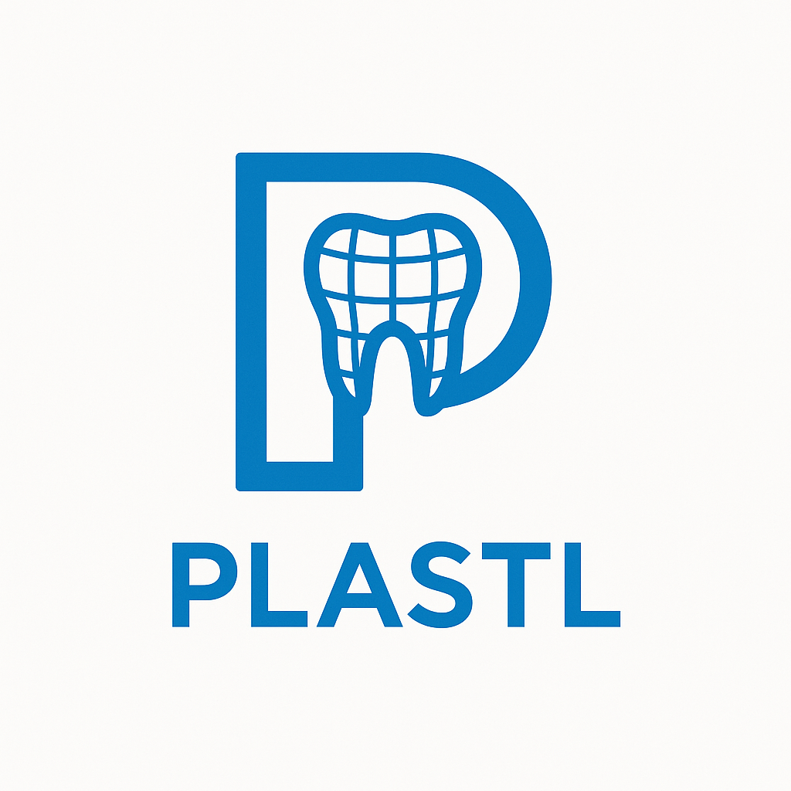

# 🦷 Plastl Mesh Converter

Plastl is a lightweight and user-friendly mesh format converter for dental applications. Built with **PyQt5** and powered by **Trimesh**, it allows you to convert mesh files between .PLY, .STL, and .OBJ formats — efficiently and effortlessly.

<p align="center">
  
</p>

## 🚀 Features
- ✅ Batch Conversion: Select multiple files or drag-and-drop them into the app.
- ⚡ Parallel Processing: Converts meshes using multiple CPU cores for blazing-fast performance.
- 🔁 Bidirectional Format Support: Convert between PLY ↔ STL, OBJ ↔ STL, etc.
- 🧾 Intuitive UI: Clean, minimal interface with logging for quick feedback.
- 💾 Compression Insight: Displays space savings after conversion (for PLY output).
- 📂 Integrated Folder Handling: Quickly open the output directory directly from the app.

## 📦 Supported Formats

| Input Format | Supported Output Formats |
|--------------|---------------------------|
| `.stl`       | `.ply`, `.stl`            |
| `.ply`       | `.stl`, `.ply`            |
| `.obj`       | `.stl`, `.ply`            |

## 🛠 Requirements
- Python ≥ 3.8
- PyQt5
- Trimesh

## Install dependencies

```bash
pip install trimesh PyQt5
```

## ▶️ How to Use

```bash
python plastl.py
```

1.	Launch the application.
2.	Drag & drop or select mesh files (.stl, .ply, .obj).
3.	Choose an output format.
4.	Pick an output folder.
5.	Click Run – and watch the magic happen!

## 💡 Why “Plastl”?

Inspired by **Plaster + STL**, Plastl pays homage to the physical dental casts now transformed into clean digital meshes.

## 📸 Screenshots

*Coming soon...*

## 🧪 Known Limitations

-	No preview or mesh inspection (yet).
-	May not support some malformed mesh files.

## 📜 License

MIT License
